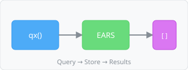

  Entity Retrieval

  1. "Get all threads"
  2. "Find thread T-123"
  3. "Get all documents"
  4. "Find document DOC-45"
  5. "Get all flows"

  Filtering & Search

  6. "Find all open threads"
  7. "Get threads with tag 'bug'"
  8. "Find documents containing 'API' in name"
  9. "Get all resolved threads"
  10. "Find flows with status 'published'"

  Relationship Queries

  11. "Get all documents in collection C-5"
  12. "Find nodes in flow F-1"
  13. "Get messages in thread T-89"
  14. "Find child collections of C-3"
  15. "Get threads linked to T-22"

  Counting & Aggregation

  16. "Count total threads"
  17. "How many documents are in collection C-5"
  18. "Count nodes in flow F-1"
  19. "Total number of open threads"
  20. "Check if document DOC-15 exists"

  Sorting & Ordering

  21. "Get threads sorted by most recent activity"
  22. "List documents by creation date"
  23. "Get flows ordered by name"
  24. "Find oldest threads first"
  25. "Sort collections alphabetically"

  Role-based Queries

  26. "Find the root flow"
  27. "Get the active thread"
  28. "Find entry node in flow F-1"
  29. "Get all featured documents"
  30. "Find entities with admin role"

  Complex Traversals

  31. "Get all documents in collections under C-1"
  32. "Find nodes connected to node N-45"
  33. "Get threads that are parents of resolved threads"
  34. "Find all prompts used in flow F-1"
  35. "Get documents referenced by thread T-12"

  Field Selection

  36. "Get thread topics and statuses only"
  37. "List document names and sizes"
  38. "Get flow IDs and labels"
  39. "Find node positions in flow F-1"
  40. "Get thread timestamps and priorities"